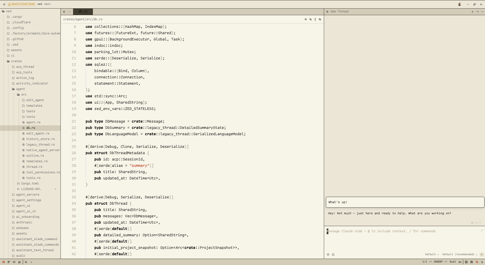
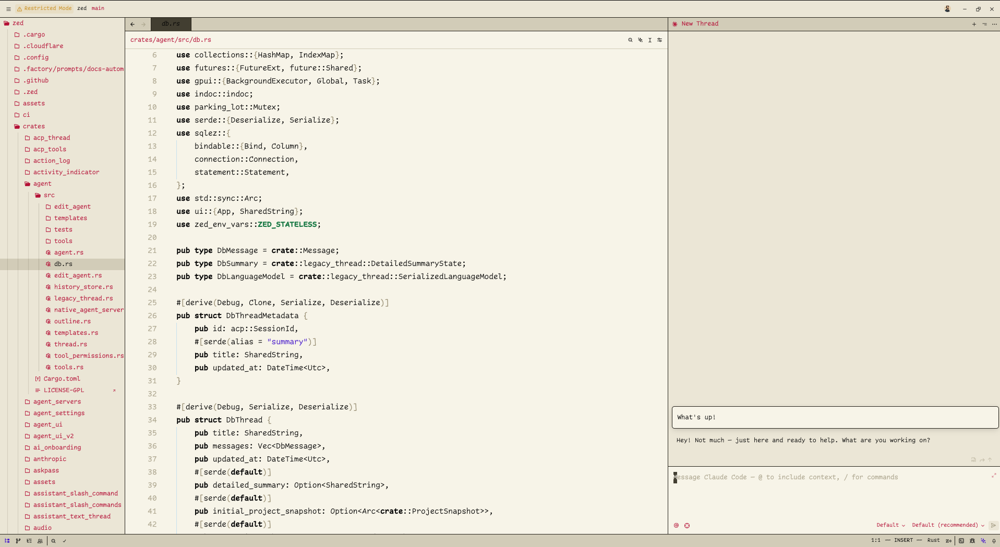

# Sharp Solarized Theme for Zed


<p align="center">
    <span><i>A sepia-toned, high-contrast light theme family for [Zed](https://zed.dev).</i></span>
    </br>
    <a href="https://github.com/leodiegues/sharp-solarized-zed-theme/stargazers"></a>
    <a href="https://github.com/leodiegues/sharp-solarized-zed-theme/issues"></a>
    <a href="https://github.com/leodiegues/sharp-solarized-zed-theme/contributors"></a>
</p>

## Variants

### Sharp Solarized

<p align="center">
    
</p>

A monochrome palette with a single accent color for highlighting strings (dark red).

### Sharp Solarized+

<p align="center">
    
</p>

A three-color palette featuring distinct colors for:

- Strings (purple)
- Comments (magenta)
- Constants (green)

## Installation

### From Zed Extensions

1. Open Zed
2. Go to Extensions (Cmd+Shift+X)
3. Search for "Sharp Solarized"
4. Click Install

### Manual Installation

Copy the theme file to your Zed themes directory:

```bash
cp themes/sharp-solarized.json ~/.config/zed/themes/
```

Then select "Sharp Solarized" or "Sharp Solarized+" in your Zed settings.

## Credits

Based on the VSCode themes:

- [Solarized High Contrast Light](https://github.com/tinytinytinytiny/solarized-high-contrast-light) by tinytinytinytiny
- [Sharp Solarized](https://github.com/joshspicer/sharp-solarized) by Josh Spicer

## License

MIT
